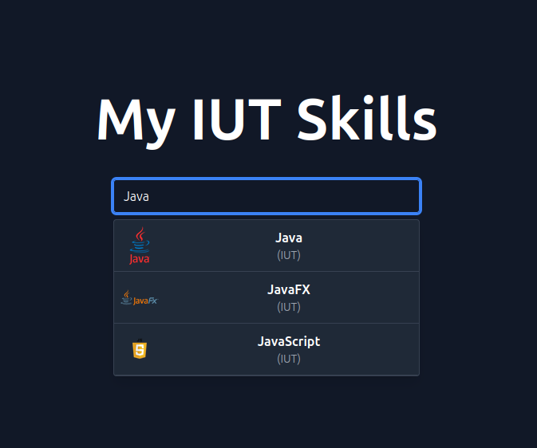
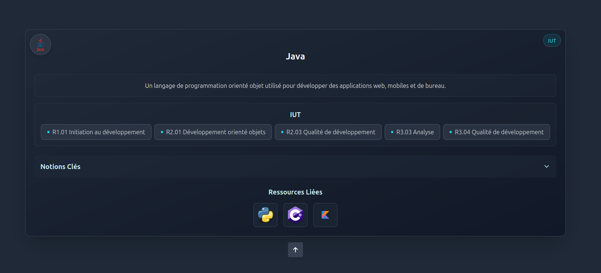

# My-IUT-Skills

Ce site regroupe un ensemble de ressources liées à l'IUT et à l'informatique. Il vous permet de retrouver vos compétences et de rechercher les technologies ou notions similaires à une autre ressource.

## Aperçu

### Recherche

### Résultat

## 📢 ATTENTION 📢

Ce projet a été mis en pause.
Un ensemble de données à déjà été collecté pour une documentation brève, mais le suivi / mise à jour du site ne peut s'effectuer facilement avec GitHub Pages.
Nous avons donc décidé de pauser le projet pour l'instant, libre à vous de vous y intéresser ou inspirer.

## Sources

Les sources des données récoltées sont accessibles depuis le fichier **sources.md**.
